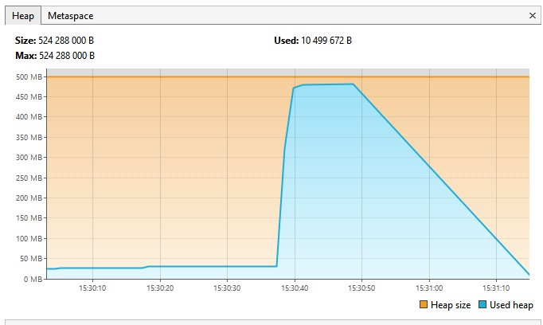
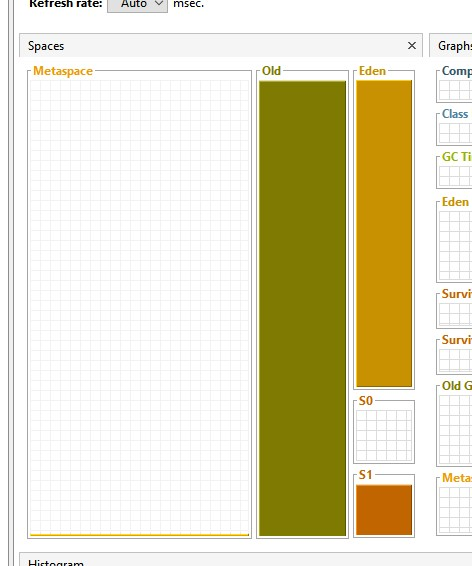
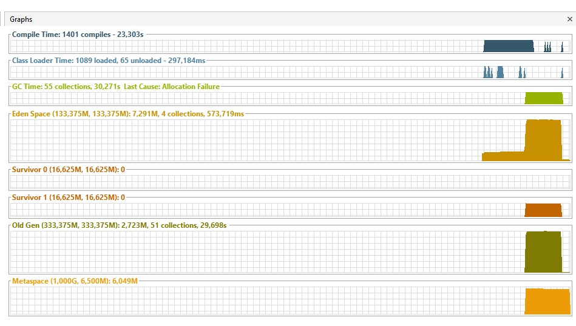
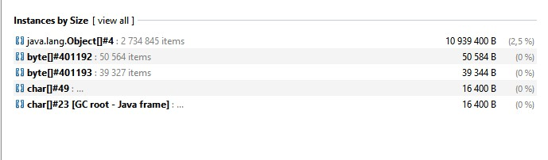
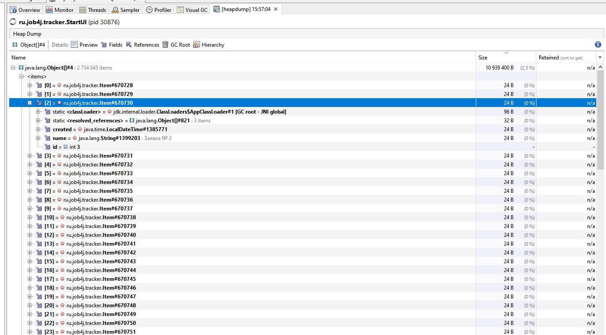
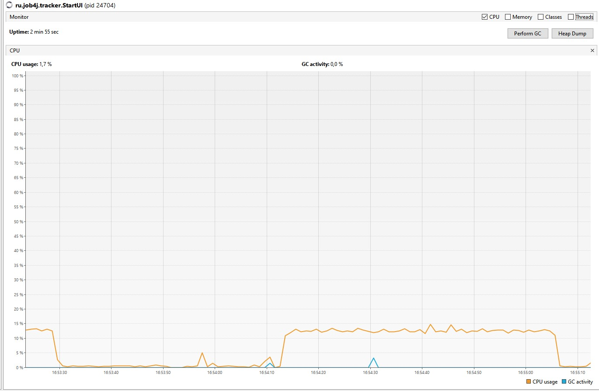
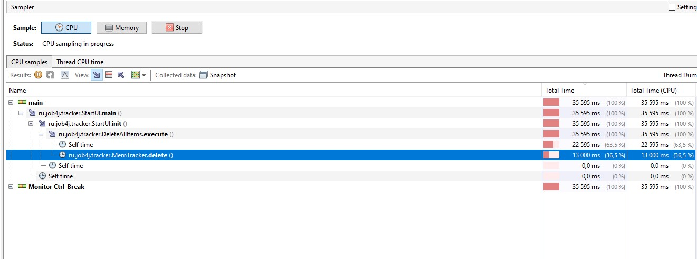
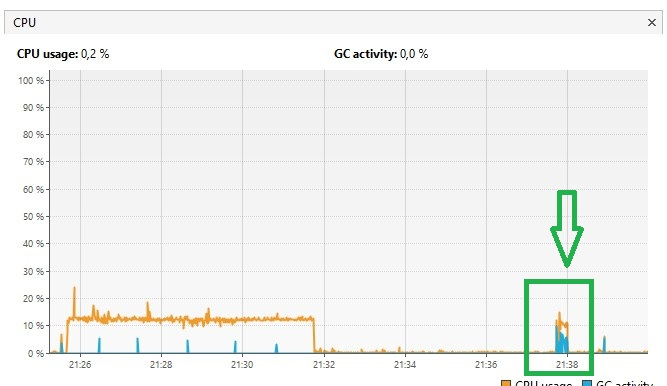
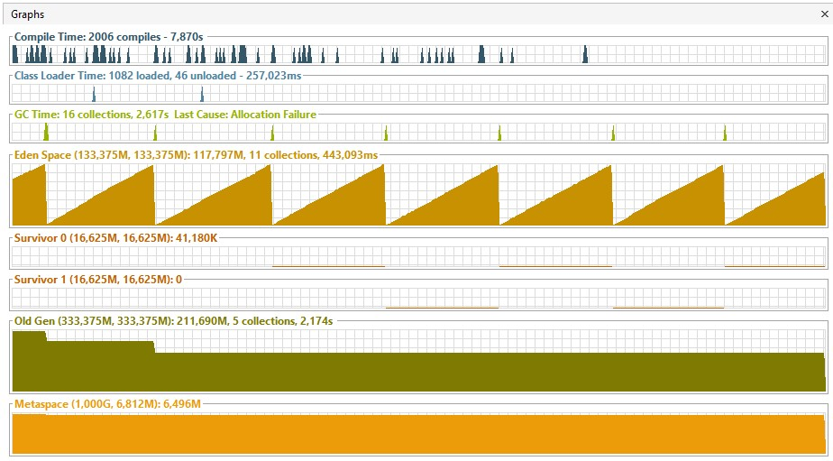

<h1>Профилирование трекера</h1>

<b>Параметры виртуальной машины:</b> -XX:+UseParallelGC -Xmx500m -Xms500m

<h4>Используемые инструменты:</h4>
<ul>
    <li>профилировщик Visual VM</li>
    <li>плагин Visual GC</li>
</ul>
<h4>Анализ:</h4>

При добавлении большого количества объектов (например: при заданных ограничениях 3млн объектов типа Item), не помещающихся в памяти кучи программа завершается с ошибкой OutOfMemoryError. Это видно на вкладке Monitor на графике Heap (рис 1). А так же на вкладке Visual GC мы видим переполнение всех регионов кучи (рис 2, рис 3).

<figure>
    
    <figcaption>Рис 1. Переполнение кучи на Monitor -> Heap</figcaption>
</figure>
<figure>
    
    <figcaption>Рис 2. Переполнение кучи в Visual GC</figcaption>
</figure>
<figure>
    
    <figcaption>Рис 3. Переполнение кучи в Visual GC</figcaption>
</figure>

Посмотреть содержимое кучи в конкретный момент времени мы можем с помощью Heap Dump раздел instances by Size. В нашем случае видим следующее:

<figure>
    
    <figcaption>Рис 4. instances by Size</figcaption>
</figure>
<figure>
    
    <figcaption>Рис 5. Подробная информация об объектах</figcaption>
</figure>

При удалении всех объектов, активно задействуется ресурс процессора. Это особенно заметно при удалении большого числа объектов, например 1млн. Это заметно на вкладке Monitor на графике CPU (рис 6). Подробно изучить какие методы потребляют больше всего времени и ресурсов CPU можно на вкладке Sampler -> CPU -> CPU samples (рис 7), где можно сделать snapshot в момент максимальной нагрузки.

<figure>
    
    <figcaption>Рис 6. Monitor -> CPU</figcaption>
</figure>
<figure>
    
    <figcaption>Рис 7. instances by Size</figcaption>
</figure>

Показ всех заявок, так же активно задействуется ресурс процессора, но выполняется значительно быстрее (рис 8).

<figure>
    
    <figcaption>Рис 8. Monitor -> CPU</figcaption>
</figure>

Исходя из анализа можно сделать вывод, что слабое место программы это удаление всех заявок. Метод execute имеет сложность O(n^2) (проходится по всем элементам списка O(n) и на каждой итерации удаляет заявку с начала списка O(n)). Для оптимизации можно реализовать в MemTracker метод deleteAll, который будет для списка заявок выполнять метод List.clear().

Показ всех заявок выполняется значительно быстрее, т.к. операция имеет линейную сложность выполнения.

<h4>Сборка мусора:</h4>
С помощью плагина Visual GC можно отслеживать малые и полные сборки мусора на следующемграфике:
<figure>
    
    <figcaption>Рис 9. Visual GC</figcaption>
</figure>